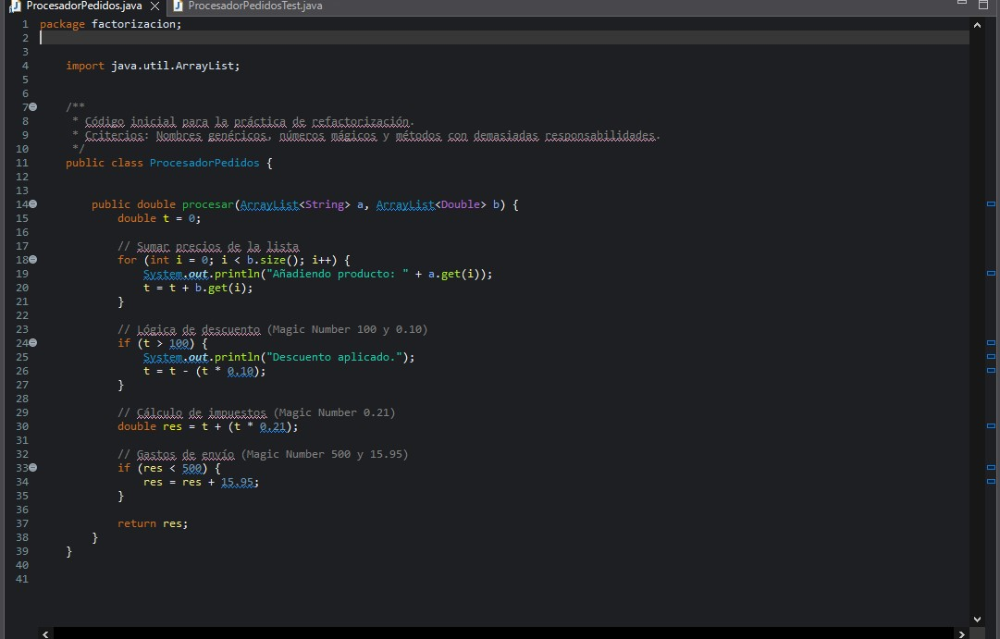

# Optimizacion_Entorno

Práctica: Optimización, Análisis y Automatización de Código Java
1. Introducción

En esta práctica trabajamos sobre un módulo Java de gestión de pedidos que presenta una elevada deuda técnica. El objetivo no es únicamente que el código funcione, sino que sea mantenible, legible y escalable, aplicando buenas prácticas profesionales de desarrollo de software.

A lo largo de la actividad se realizan tareas de análisis estático, creación de pruebas unitarias, refactorización segura con herramientas del IDE y preparación para integración continua, utilizando tecnologías estándar del ecosistema Java.

2. Tecnologías y Herramientas Utilizadas

Java 17

Eclipse IDE

Maven

JUnit 4

Git y GitHub

GitHub Actions (pendiente de configurar)

SonarLint / SonarQube (análisis estático)

3. Fase 1 – Análisis Estático y Configuración (CE c, d)

Antes de realizar cualquier modificación en el código, se llevó a cabo una auditoría del mismo mediante herramientas de análisis estático.

Se intentó la instalación y configuración de SonarLint/SonarQube en Eclipse con el objetivo de identificar problemas como:

Uso de números mágicos

Complejidad cognitiva elevada

Falta de claridad en nombres de variables

Debido a limitaciones técnicas en el entorno (no disponibilidad de un servidor SonarQube local), no fue posible completar la conexión con un servidor activo. No obstante, se revisaron las reglas de calidad y su finalidad, documentando el análisis previo como paso fundamental antes de la refactorización.

CAPTURAS DE PANTALLA:
    

4. Fase 2 – Red de Seguridad con Pruebas Unitarias (CE b)

Antes de refactorizar el código, se creó una red de seguridad mediante pruebas unitarias, garantizando que el comportamiento funcional se mantiene intacto durante los cambios.

4.1 Creación del test unitario

Se implementó la clase ProcesadorPedidosTest.java utilizando JUnit 4, validando el cálculo correcto de:

Suma de precios

Aplicación de descuentos

Cálculo de IVA

Gastos de envío

El proyecto fue configurado correctamente como proyecto Maven, incluyendo la dependencia de JUnit en el archivo pom.xml.

4.2 Ejecución de pruebas

El test fue ejecutado con resultado VERDE, confirmando que el comportamiento actual del sistema es correcto y permitiendo avanzar con seguridad a la fase de refactorización.

📸 Se adjunta captura de la ejecución del test en verde.

5. Control de Versiones con Git y GitHub

El proyecto se encuentra bajo control de versiones utilizando Git.

5.1 Configuración del repositorio

Inicialización del repositorio Git.

Configuración del archivo .gitignore para excluir:

Archivos generados por Maven (/target)

Configuraciones locales de Eclipse

Configuración local de SonarLint (.sonarlint/)

5.2 Estrategia de ramas

Se adoptó una estrategia básica de ramas:

main: rama estable

develop: rama de desarrollo y refactorización

La rama develop fue creada a partir de main y sincronizada correctamente con el repositorio remoto en GitHub.

📸 Se incluyen capturas mostrando las ramas locales y remotas.

6. Fase 3 – Refactorización con Herramientas de Eclipse (CE a, e)

La refactorización del código se realiza exclusivamente mediante herramientas automáticas del IDE Eclipse, sin modificar el código manualmente.

6.1 Extract Method

Se aplicó el patrón Extract Method para reducir la responsabilidad del método principal:

Extracción del cálculo del IVA a un método privado independiente.

Extracción de la lógica de gastos de envío a un método privado independiente.

Estas acciones se realizaron utilizando el atajo Alt + Shift + M y validando los cambios mediante la vista Refactor Preview.

Tras cada refactorización:

Se ejecutaron los tests unitarios.

El estado se mantuvo en verde, confirmando que la refactorización no introdujo errores.

CAPTURAS DE EXTRACT METHOD Y REFACTORIZACIÓN.
  

7. Estado Actual del Proyecto

Hasta este punto, el proyecto cuenta con:

Código probado y protegido por tests

Refactorización parcial aplicada correctamente

Historial de commits claro y coherente

Rama develop sincronizada con GitHub

8. Próximos Pasos

Las tareas pendientes para completar la práctica son:

Aplicar Extract Constant para eliminar números mágicos.

Completar la Fase 3 de refactorización.

Configurar GitHub Actions para Integración Continua (CE i).

Probar el fallo y recuperación del pipeline CI.

Finalizar la documentación y capturas para la entrega.

9. Enlace al Repositorio

🔗 Repositorio en GitHub:
(añadir aquí el enlace al repositorio)