1. INGTRODUCCIÓN

En esta práctica se trabaja sobre un módulo Java de gestión de pedidos que presenta una elevada deuda técnica. El objetivo no es únicamente que el código funcione, sino que sea mantenible, legible y escalable, aplicando buenas prácticas profesionales de desarrollo de software.

A lo largo de la actividad se realizan tareas de análisis estático, creación de pruebas unitarias, refactorización segura mediante herramientas del IDE y automatización mediante Integración Continua, utilizando tecnologías estándar del ecosistema Java.

2. TECNOLOGÍAS Y HERRAMIENTAS UTILIZADAS:

-Java 17

-Eclipse IDE

-Maven

-JUnit 5

-Git y GitHub

-GitHub Actions (Integración Continua)

-SonarLint / SonarQube (análisis estático)

3. FASE 1-ANÁLISIS ESTÁTICO Y CONFIGURACIÓN (CE c, CE d)

Antes de realizar cualquier modificación en el código, se llevó a cabo una auditoría inicial mediante herramientas de análisis estático con el objetivo de identificar problemas de calidad como:

Uso de números mágicos

Complejidad cognitiva elevada

Nombres de variables poco descriptivos

Se intentó la instalación y configuración de SonarLint/SonarQube en Eclipse. Debido a limitaciones técnicas del entorno (no disponibilidad de un servidor SonarQube local activo), no fue posible establecer conexión con un servidor remoto. No obstante, se analizaron las reglas de calidad, su propósito y su impacto en el código, documentando este análisis como paso previo imprescindible antes de la refactorización.

EVIDENCIAS
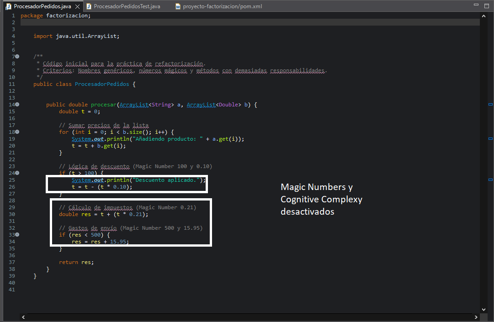
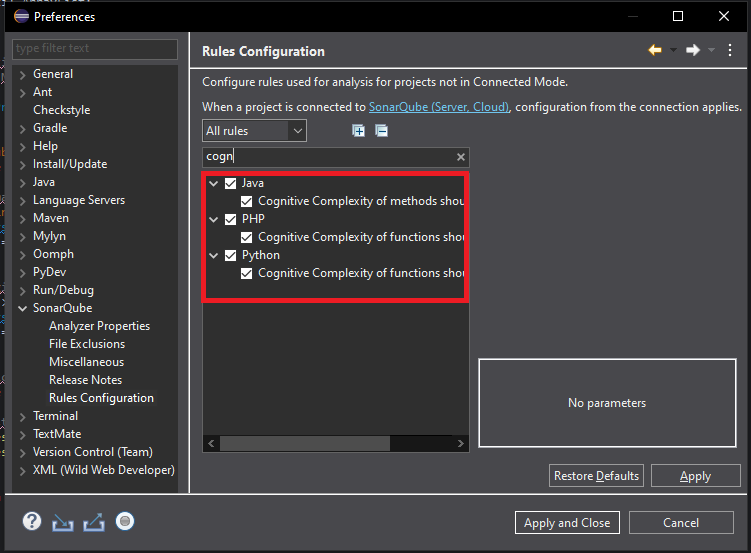
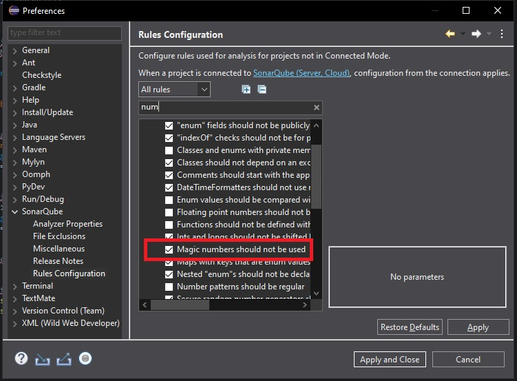
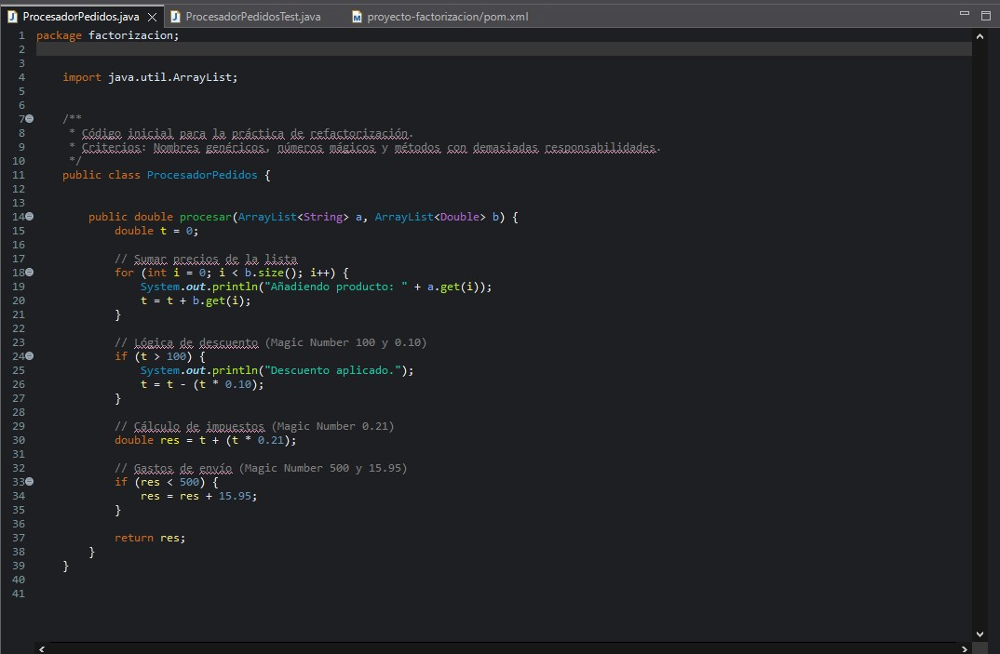

Capturas de la configuración y activación/desactivación de reglas (Magic Numbers, Cognitive Complexity).

4. FASE 2 - RED DE SEGURIDAD CON PRUEBAS UNITARIAS (CE b)

Antes de refactorizar el código, se creó una red de seguridad mediante pruebas unitarias, garantizando que el comportamiento funcional del sistema se mantiene intacto durante los cambios.

4.1 CREACIÓN DEL TEST UNITARIO.

Se implementó la clase ProcesadorPedidosTest.java utilizando JUnit 4, validando:

Suma de precios

Aplicación de descuentos

Cálculo del IVA

Gastos de envío

El proyecto fue configurado correctamente como proyecto Maven, incluyendo la dependencia de JUnit en el archivo pom.xml.

4.2 EJECUCIÓN DE PRUEBAS.

Los tests fueron ejecutados con resultado VERDE, confirmando el correcto funcionamiento del sistema y permitiendo avanzar con seguridad a la fase de refactorización.

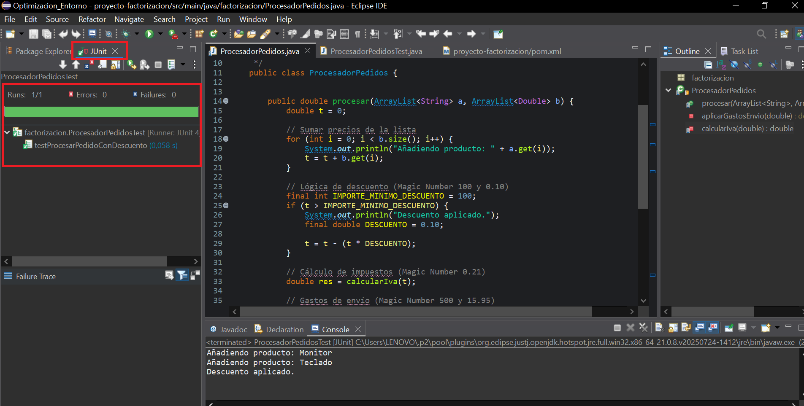

Se adjuntan capturas de la ejecución de los tests en verde.

5. CONTROL DE VERSIONES CON GIT Y GITHUB.

El proyecto se encuentra bajo control de versiones utilizando Git y alojado en GitHub.

5.1 Configuración del repositorio

Inicialización del repositorio Git.

Configuración del archivo .gitignore para excluir:

Archivos generados por Maven (/target)

Configuraciones locales de Eclipse

Configuración local de SonarLint (.sonarlint/)

5.2 ESTRATEGÍA DE RAMAS.

Se adoptó una estrategia básica de ramas:

main: rama estable

develop: rama de desarrollo y refactorización

La rama develop fue creada a partir de main y sincronizada correctamente con el repositorio remoto.

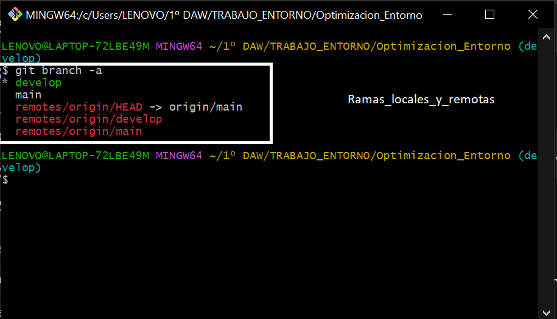

Captura que muestra la existencia de las ramas main y develop tanto en local como en el repositorio remoto (origin), verificando su correcta sincronización

6. FASE 3 - REFACTORIZACIÓN CON HERRAMIENTAS DE ECLIPSE (CE a, CE e)

La refactorización se realizó exclusivamente mediante herramientas automáticas de Eclipse, sin modificar manualmente el código.

6.1 RENAME (Renombrado de variables)

Se sustituyeron nombres genéricos por nombres semánticos y representativos del dominio del problema, mejorando la legibilidad y mantenibilidad del código.

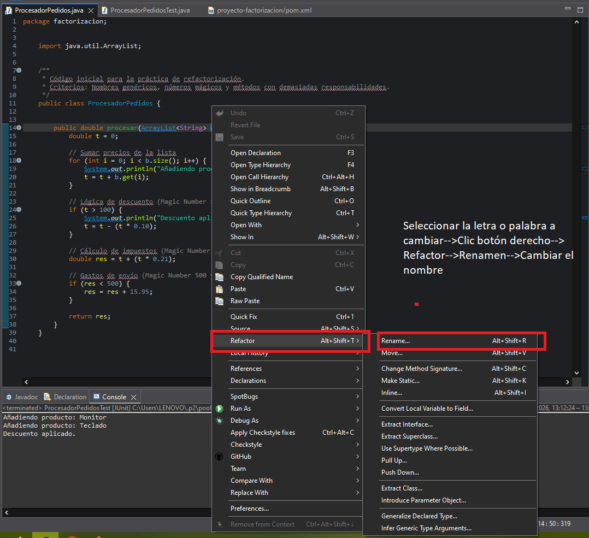

6.2 EXTRACT METHOD (Extracción de métodos)

Se aplicó el patrón Extract Method para reducir la responsabilidad del método principal:

Extracción del cálculo del IVA a un método privado independiente.

Extracción de la lógica de gastos de envío a un método privado independiente.

Las refactorizaciones se realizaron mediante Refactor → Extract Method (Alt + Shift + M), validando los cambios mediante la vista Refactor Preview.

Tras cada refactorización:

Se ejecutaron los tests unitarios.

El estado se mantuvo en VERDE, confirmando que no se introdujeron errores.

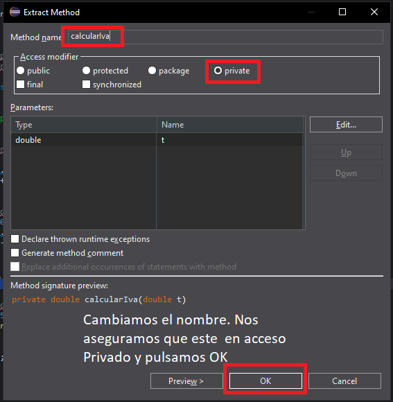
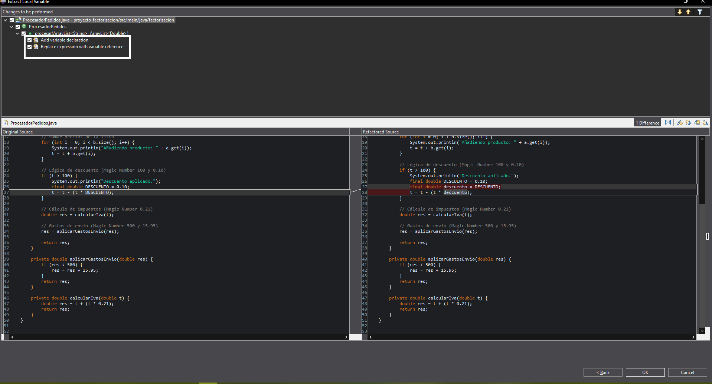

Se adjuntan capturas de la vista Refactor Preview.

6.3 EXTRACT CONSTANT (Eliminación de números mágicos)

Se eliminaron los números mágicos del código, sustituyéndolos por constantes de clase con nombres descriptivos, facilitando el mantenimiento y la comprensión de las reglas de negocio.

Constantes extraídas:

DESCUENTO

IMPORTE_MINIMO_DESCUENTO

IVA

IMPORTE_ENVIO_GRATIS

GASTOS_ENVIO

Herramienta utilizada:
Refactor → Extract Constant (Alt + Shift + L)

![EXTRACT_CONSTANT_A]IMAGENES/ExtractMethodA.png
![EXTRACT_CONSTANT_B]IMAGENES/ExtractConstantB.png 
![EXTRACT_CONSTANT_C]IMAGENES/ExtractConstantC.png 
![EXTRACT_CONSTANT_D]IMAGENES/ExtractConstantD.png 
![EXTRACT_CONSTANT_E]IMAGENES/ExtractConstantE.png 
![EXTRACT_CONSTANT_F]IMAGENES/ExtractConstantF.png 
![EXTRACT_CONSTANT_G]IMAGENES/ExtractConstantG.png 
![EXTRACT_CONSTANT_H]IMAGENES/ExtractConstantH.png 
![EXTRACT_CONSTANT_I]IMAGENES/ExtractConstantI.png 
![EXTRACT_CONSTANT_J]IMAGENES/ExtractConstantJ.png

Se adjuntan capturas de la vista Refactor Preview.

7. FASE 4 - INTEGRACIÓN CONTINUA CON GITHUB ACTIONS (CE i)

Se configuró un flujo de Integración Continua (CI) mediante GitHub Actions, encargado de:

Compilar el proyecto Maven.

Ejecutar automáticamente los tests unitarios en cada push.

El pipeline fue correctamente ejecutado, obteniendo un estado final SUCCESS, lo que confirma que el proyecto compila y supera todas las pruebas de forma automatizada.

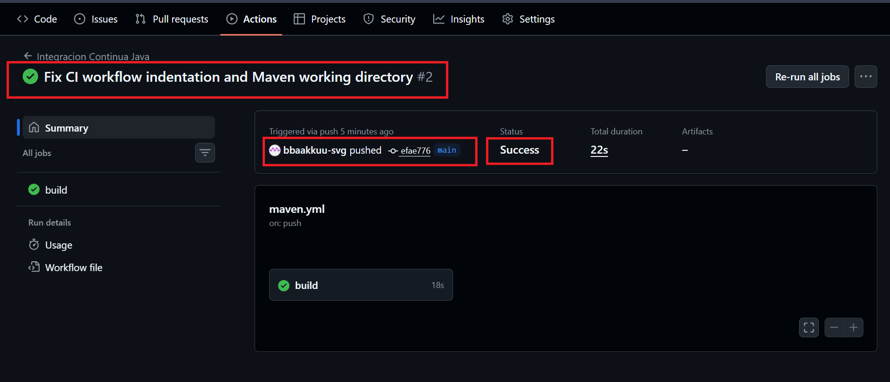

Se adjuntan capturas del workflow ejecutado en verde.

8. ESTADO FINAL DEL PROYECTO.

El proyecto cuenta actualmente con:

Código protegido por pruebas unitarias.

Refactorización aplicada de forma segura y controlada.

Eliminación de deuda técnica (números mágicos y métodos complejos).

Integración Continua configurada y operativa.

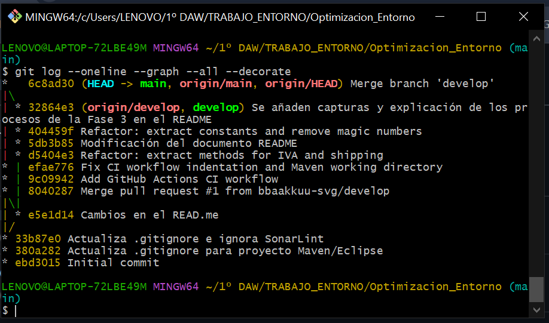
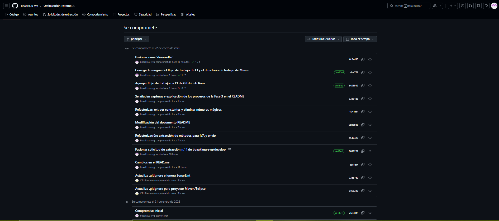

Historial de commits claro y coherente.

9. ENLACE AL REPOSITORIO.

 Repositorio en GitHub:
https://github.com/bbaakkuu-svg/Optimizacion_Entorno.git